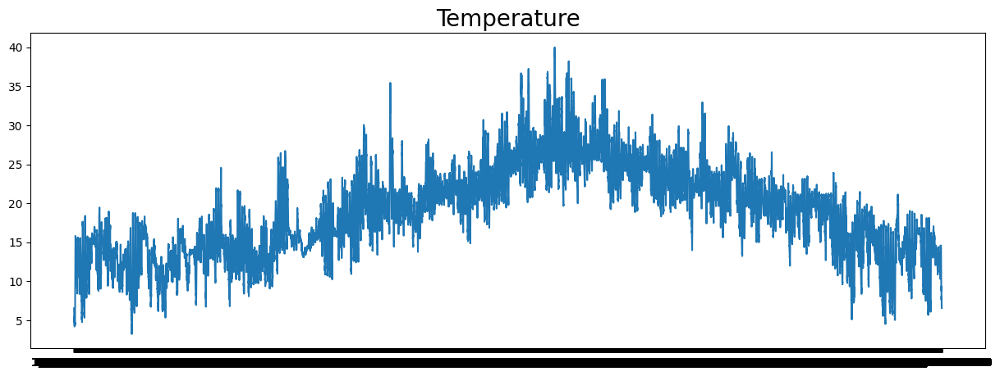

<h1 align="center">
Model For a Prediction Regarding Temperature Data Series
</h1>

Hanya sekedar model untuk mencoba LSTM (Long Short Term Memory) apakah mampu membuat model yang mempunyai MAE < 10% skala data. Hasilnya menunjukkan target MAE < 10% dicapai dalam satu epoch

<h2 align="center">
Preview Data
</h2>

  
  <!--  -->

  <!-- 
   -->

<h2 align="center">
Presented By
</h2>
<h3 align="center">Rafi Rachmad Ramadhan</h3>
 
